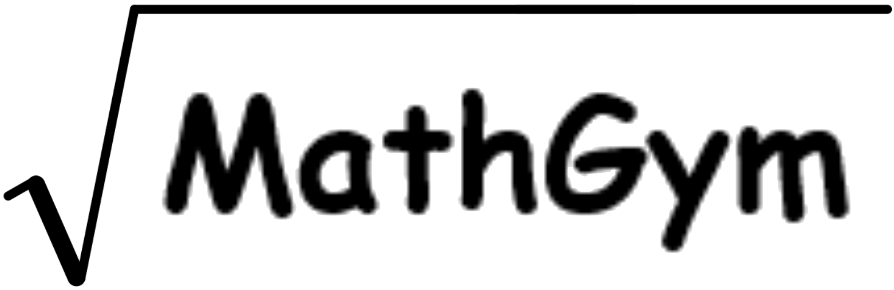

# 🧮 MathGym — интерактивный тренажёр по математике

[](https://www.python.org/)
[](https://flask.palletsprojects.com/)
[](LICENSE)

**MathGym** — это веб-приложение для тренировки навыков решения задач с квадратными корнями. Проект разработан студентами Ликино‑Дулёвского политехнического колледжа в рамках конкурсного кейса на основе реальных задач от работодателей и предназначен для школьников, студентов и всех, кто хочет улучшить свои математические способности в интерактивной форме.



---

## 📌 Основные возможности

- **Три уровня сложности** – легкий, средний, сложный (задачи генерируются динамически).
- **Гибкие настройки** – смена имени профиля, ограничение по времени на задание, ограничение количества заданий.
- **Мгновенная обратная связь** – после каждого ответа показывается правильность, ведётся счётчик ошибок.
- **Статистика** – подсчёт правильных/неправильных ответов, время выполнения тренировки.
- **Детальный отчёт** – после завершения можно скачать документ `.docx` с результатами, временем и списком ошибок (с формулами).
- **Адаптивный интерфейс** - интуитивно-понятный интерфейс.

---

## 🖥️ Технологии

- **Backend**: Python 3.8+, Flask
- **Frontend**: HTML5, CSS3, JavaScript (с использованием MathJax для отображения формул)
- **Генерация отчётов**: `python-docx`, `math2docx`
- **Хранение настроек**: JSON (файл `data/settings.json`)

---

## 🚀 Установка и запуск

### 1. Клонируйте репозиторий
```bash
git clone https://github.com/vladislavboev2007/MathGym.git
```

### 2. Перейдите в папку `AppFlask`
```bash
cd AppFlask
```

### 3. Создайте виртуальное окружение (рекомендуется)
```bash
python -m venv venv
source venv/bin/activate      # для Linux/Mac
venv\Scripts\activate         # для Windows
```

### 4. Установите зависимости
```bash
pip install -r requirements.txt
```
Если файла `requirements.txt` нет, установите вручную:
```bash
pip install flask python-docx math2docx
```

### 5. Запустите приложение
```bash
python app.py
```
Приложение будет доступно по адресу: http://127.0.0.1:5000

---

## 📂 Структура проекта


---

## 🧪 Использование

1. **Главная страница** – отображается имя профиля и общий процент способности решения задач.

2. **Настройки** – задайте имя, включите ограничения по времени или количеству заданий.

3. **Выбор уровня** – выберите один из трёх уровней сложности.

4. **Тренировка** – решайте задачи, нажимая на кнопки с вариантами ответов. Таймер (если включён) отсчитывает время на каждое задание.

5. **Результат** – после завершения (или нажатия «Завершить») отображается статистика. Вы можете скачать отчёт или посмотреть список ошибок.

6. **Ошибки** – просмотрите все ошибки с правильными ответами для повторения.


---
## 👥 Авторы
* **Боев Владислав** – разработчик (Python, Flask)

* **Колпаков Матвей** – разработчик (генерация задач, логика)

* **Бондарь Иван** – предметник, тестирование интерфейса

* **Феоктистов Глеб** – исследование, социология, тестирование

---
## 📄 Лицензия

Проект распространяется под лицензией **MIT**.
